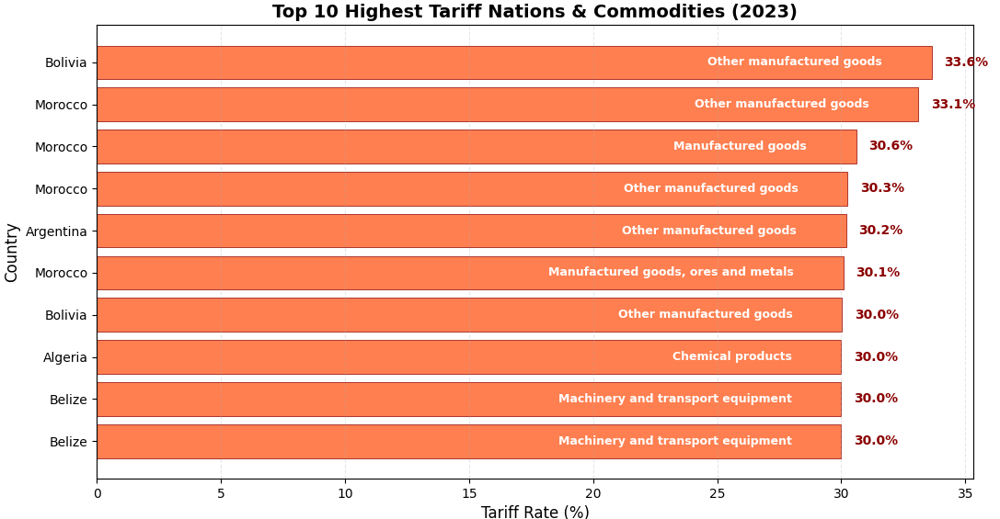
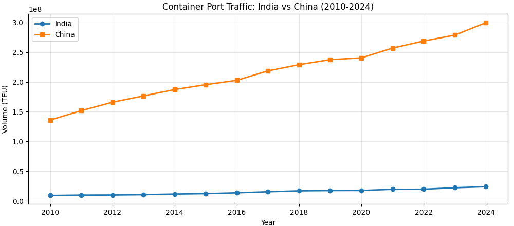
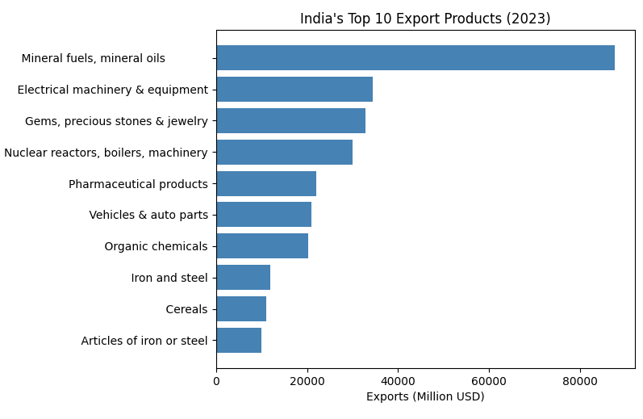
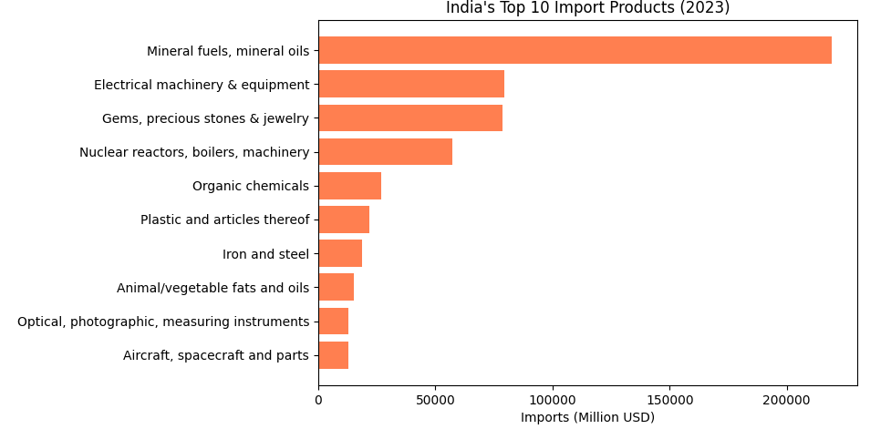

# India Trade Explorer: SQL + Python Analytics

[](https://www.python.org/)
[](https://www.postgresql.org/)
[](https://opensource.org/licenses/MIT)

A comprehensive data pipeline analyzing India's international trade patterns, port traffic, and tariff rates using SQL (PostgreSQL) and Python visualizations.

## 📊 Pipeline Overview

**Data Source → PostgreSQL → Python Visualization**

This project demonstrates a complete data engineering and analytics workflow:

1. **Data Collection** - Downloaded from authoritative government and international sources
2. **Data Cleaning & Loading** - Python scripts load and clean data into PostgreSQL
3. **SQL Analysis** - Complex queries for trade patterns, balances, and trends
4. **Visualization** - Python generates plots

## 📦 Data Sources

| Dataset | Source | Description |
|---------|--------|-------------|
| Port Traffic | [UNCTADstat](https://unctadstat.unctad.org/datacentre/) | Container port traffic volumes |
| HS Codes | [World Bank WITS](https://wits.worldbank.org/referencedata.html) | Harmonized System product classification |
| Import/Export | [DGFT India](https://www.dgft.gov.in/CP/?opt=itchs-import-export) | India's trade data (2018-2025) |
| Tariff Rates | [UNCTADstat](https://unctadstat.unctad.org/datacentre/) | Import tariff rates on non-agricultural/non-fuel products |

## 🗄️ Finddings

### India Trade Balance (2018-2024)

India has consistently maintained a **trade deficit** throughout the 2018-2024 period, meaning imports have exceeded exports every year. The deficit narrowed temporarily in 2020 (likely due to pandemic-related disruptions) but widened significantly post-2021, reaching its highest level in 2024 at **27,782 Million**.

```sql
SELECT 
    COALESCE(e.year, i.year) as year,
    COALESCE(SUM(e.amt), 0) as total_exports,
    COALESCE(SUM(i.amt), 0) as total_imports,
    COALESCE(SUM(e.amt), 0) - COALESCE(SUM(i.amt), 0) as trade_balance
FROM exports_india e
FULL OUTER JOIN imports_india i ON e.year = i.year
GROUP BY COALESCE(e.year, i.year)
ORDER BY year;
```

```markdown
**Query Results:**

| year | total_exports | total_imports | trade_balance(mn) |
|------|--------------|---------------|----------------|
| 2018 | 32347653.8000 | 50379684.1800 | -18032030.3800 |
| 2019 | 30709385.8400 | 46521510.4200 | -15812124.5800 |
| 2020 | 28597234.9600 | 38654717.2200 | -10057482.2600 |
| 2021 | 41356431.2000 | 60079101.8800 | -18722670.6800 |
| 2022 | 44204857.0600 | 70164953.1800 | -25960096.1200 |
| 2023 | 42833061.8800 | 66465048.4400 | -23631986.5600 |
| 2024 | 42895045.9000 | 70677624.5000 | -27782578.6000 |

```


### Top 10 Highest Tariff Nations & Commodities in 2023
This analysis identifies countries with the highest protective trade barriers. Morocco and Bolivia dominate the list, with Morocco appearing 4 times across different product categories. The highest tariff rate (33.64%) is imposed by Bolivia on "Other manufactured goods" (HS Code 9). Notably, Argentina, Algeria, and Belize also feature among the most protectionist nations for specific commodity categories.

```sql
SELECT 
    Market_Label as country,
    HSCode,
    ProductCategory_Label as product_category,
    Simple_average_of_rates as tariff_rate_percent
FROM tariff_rates
WHERE year = 2023
    AND Simple_average_of_rates IS NOT NULL
ORDER BY Simple_average_of_rates DESC
LIMIT 10;
```
```markdown
| Rank | Country | Highest Tariff (%) | Product Category |
|------|---------|-------------------|------------------|
| 1 | Bolivia | 33.64% | Other manufactured goods |
| 2 | Morocco | 33.11% | Other manufactured goods |
| 3 | Argentina | 30.19% | Other manufactured goods |
| 4 | Algeria | 30.00% | Chemical products |
| 5 | Belize | 30.00% | Machinery & transport equipment |
```


###  India Container Port Traffic Growth (2010-2024)
Container traffic is a key indicator of trade volume and economic activity. China consistently handles 10-12x more container volume than India, reflecting its dominant position in global trade. However, both nations show strong growth trends:

India grew from 9.2M TEU (2010) to 23.9M TEU (2024) → 159% increase;

China grew from 136M TEU (2010) to 299.7M TEU (2024) → 120% increase

```sql

SELECT 
    year,
    SUM(CASE WHEN Economy_Label = 'India' THEN twentyftEU ELSE 0 END) as india_volume,
    SUM(CASE WHEN Economy_Label = 'China' THEN twentyftEU ELSE 0 END) as china_volume
FROM port_traffic
WHERE Economy_Label IN ('India', 'China')
GROUP BY year
ORDER BY year;


```

```marakdown
year,    india_volume,    china_volume
2010,    9235765.00,        136044183.00
2011,    9878067.00,        151800937.00
2012,    10017480.00,        165939400.00
2013,    10571320.00,        176607144.00
2014,    11652174.00,        187291913.00
2015,    12318610.00,        195509165.00
2016,    13724110.00,        202830580.00
2017,    15450523.00,        218712874.00
2018,    16996593.00,        229127700.00
2019,    17487621.00,        237570000.00
2020,    17597062.00,        240480000.00
2021,    19561769.00,        256945700.00
2022,    19717168.00,        268790000.00
2023,    22208000.00,        278759834.00
2024,    23898000.00,        299703800.00

```



### India's Top 10 Export Products (2023)
Mineral fuels (primarily petroleum products) dominate India's exports at $87.6 billion, accounting for nearly 25% of total exports. This is followed by electrical machinery ($34.4B) and gems & jewelry ($32.9B). The top 3 products alone represent over 50% of India's export basket.

```sql
SELECT 
    Commodity,
    amt as exports_million_usd_2023
FROM exports_india
WHERE year = 2023
    AND amt > 0
ORDER BY amt DESC
LIMIT 10;
```

```markdown

Rank	Commodity	                        Exports (Million USD)
1	    Mineral fuels, mineral oils            	87,602
2	    Electrical machinery & equipment	    34,413
3    	Gems, precious stones & jewelry	        32,853
4    	Nuclear reactors, boilers, machinery    30,057
5    	Pharmaceutical products	                22,106
6	    Vehicles & auto parts	                20,889
7	    Organic chemicals	                    20,312
8	    Iron and steel	                        11,859
9	    Cereals	                                10,994
10	    Articles of iron or steel	            9,939
```



### India's Top 10 Import Products (2023)
Mineral fuels (crude oil and petroleum products) dominate India's imports at $219 billion, representing nearly 40% of total imports. This highlights India's heavy dependence on energy imports. Electrical machinery ($79.3B) and gems & jewelry ($78.5B) follow as the second and third largest import categories.

```sql
SELECT 
    Commodity,
    amt as imports_million_usd_2023
FROM imports_india
WHERE year = 2023
    AND amt > 0
ORDER BY amt DESC
LIMIT 10;
```

```markdown
Rank	Commodity	                                Imports (Million USD)
1	    Mineral fuels, mineral oils	                    219,054
2	    Electrical machinery & equipment	            79,301
3	    Gems, precious stones & jewelry	                78,474
4	    Nuclear reactors, boilers, machinery	        57,409
5	    Organic chemicals	                            26,745
6	    Plastic and articles thereof	                21,831
7	    Iron and steel	                                18,646
8	    Animal/vegetable fats and oils	                15,059
9	    Optical, photographic, measuring instruments	12,922
10    	Aircraft, spacecraft and parts                	12,698
```



## 🙏 Acknowledgments
UNCTAD for providing open trade data
World Bank for HS code reference system
DGFT India for comprehensive trade statistics
PostgreSQL and Python open source communities

---
*Built with PostgreSQL, Python, and ❤️ for trade analytics*
