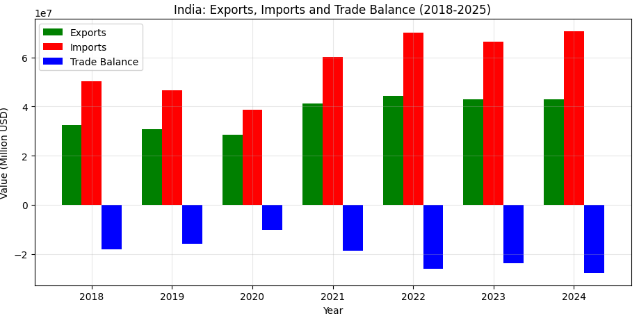
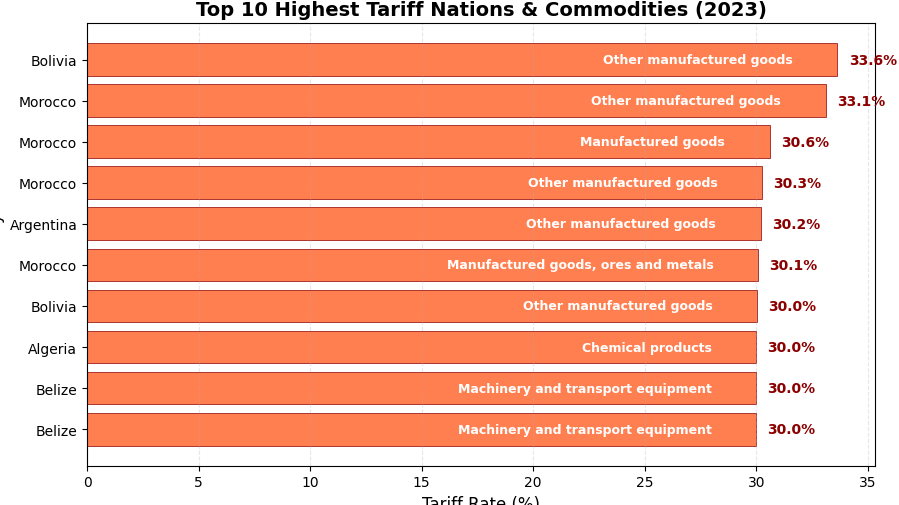

# India Trade Explorer: SQL + Python Analytics

[](https://www.python.org/)
[](https://www.postgresql.org/)
[](https://opensource.org/licenses/MIT)

A comprehensive data pipeline analyzing India's international trade patterns, port traffic, and tariff rates using SQL (PostgreSQL) and Python visualizations.

## 📊 Pipeline Overview

**Data Source → PostgreSQL → Python Visualization**

This project demonstrates a complete data engineering and analytics workflow:

1. **Data Collection** - Downloaded from authoritative government and international sources
2. **Data Cleaning & Loading** - Python scripts load and clean data into PostgreSQL
3. **SQL Analysis** - Complex queries for trade patterns, balances, and trends
4. **Visualization** - Python generates plots

## 📦 Data Sources

| Dataset | Source | Description |
|---------|--------|-------------|
| Port Traffic | [UNCTADstat](https://unctadstat.unctad.org/datacentre/) | Container port traffic volumes |
| HS Codes | [World Bank WITS](https://wits.worldbank.org/referencedata.html) | Harmonized System product classification |
| Import/Export | [DGFT India](https://www.dgft.gov.in/CP/?opt=itchs-import-export) | India's trade data (2018-2025) |
| Tariff Rates | [UNCTADstat](https://unctadstat.unctad.org/datacentre/) | Import tariff rates on non-agricultural/non-fuel products |

## 🗄️ Finddings

### India Trade Balance (2018-2024)

India has consistently maintained a **trade deficit** throughout the 2018-2024 period, meaning imports have exceeded exports every year. The deficit narrowed temporarily in 2020 (likely due to pandemic-related disruptions) but widened significantly post-2021, reaching its highest level in 2024 at **27,782 Million**.

```sql
SELECT 
    COALESCE(e.year, i.year) as year,
    COALESCE(SUM(e.amt), 0) as total_exports,
    COALESCE(SUM(i.amt), 0) as total_imports,
    COALESCE(SUM(e.amt), 0) - COALESCE(SUM(i.amt), 0) as trade_balance
FROM exports_india e
FULL OUTER JOIN imports_india i ON e.year = i.year
GROUP BY COALESCE(e.year, i.year)
ORDER BY year;
```

```markdown
**Query Results:**

| year | total_exports | total_imports | trade_balance |
|------|--------------|---------------|----------------|
| 2018 | 32347653.8000 | 50379684.1800 | -18032030.3800 |
| 2019 | 30709385.8400 | 46521510.4200 | -15812124.5800 |
| 2020 | 28597234.9600 | 38654717.2200 | -10057482.2600 |
| 2021 | 41356431.2000 | 60079101.8800 | -18722670.6800 |
| 2022 | 44204857.0600 | 70164953.1800 | -25960096.1200 |
| 2023 | 42833061.8800 | 66465048.4400 | -23631986.5600 |
| 2024 | 42895045.9000 | 70677624.5000 | -27782578.6000 |

```



### Top 10 Highest Tariff Nations & Commodities in 2023
This analysis identifies countries with the highest protective trade barriers. Morocco and Bolivia dominate the list, with Morocco appearing 4 times across different product categories. The highest tariff rate (33.64%) is imposed by Bolivia on "Other manufactured goods" (HS Code 9). Notably, Argentina, Algeria, and Belize also feature among the most protectionist nations for specific commodity categories.

```sql
SELECT 
    Market_Label as country,
    HSCode,
    ProductCategory_Label as product_category,
    Simple_average_of_rates as tariff_rate_percent
FROM tariff_rates
WHERE year = 2023
    AND Simple_average_of_rates IS NOT NULL
ORDER BY Simple_average_of_rates DESC
LIMIT 10;
```
```markdown
| Rank | Country | Highest Tariff (%) | Product Category |
|------|---------|-------------------|------------------|
| 1 | Bolivia | 33.64% | Other manufactured goods |
| 2 | Morocco | 33.11% | Other manufactured goods |
| 3 | Argentina | 30.19% | Other manufactured goods |
| 4 | Algeria | 30.00% | Chemical products |
| 5 | Belize | 30.00% | Machinery & transport equipment |
```

